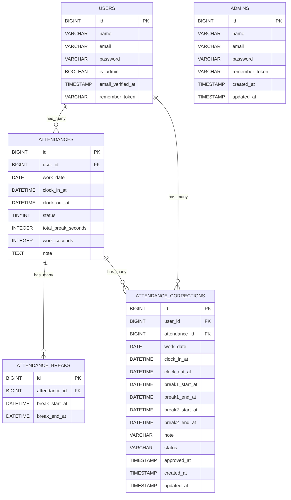

# 勤怠管理アプリ

### セットアップ（Docker / bashに入る方式）

### 0) 取得
```bash
git clone https://github.com/hayama1225/mock-exam2.git
```
```bash
cd mock-exam2
```
### 1) コンテナ起動（初回は --build 推奨）
```bash
docker compose up -d --build
```
### 2) PHPコンテナに入る（以降は /var/www = リポジトリの ./src）
```bash
docker compose exec php bash
```
※次のcd /var/wwwは必要ならば
```bash
cd /var/www
```
```bash
code .
```
### 3) 依存インストール
```bash
composer install
```
### 4) .env 作成 & アプリキー生成
```bash
cp .env.example .env
```
```bash
php artisan key:generate
```
### 5) マイグレーション & シーディング
```bash
php artisan migrate --seed
```
### 6) (任意)ダミーデータ投入※ユーザー/勤怠データを確認したい場合のみ実行
```bash
php artisan db:seed --class=DummyDataSeeder
```
### 7) ストレージ公開（画像表示に必須）※今回は不要です
```bash
php artisan storage:link
```
### 8) コンテナから抜ける
```bash
exit
```
### 9) 補足
#### DBリセットしたいとき
```bash
docker compose exec php php artisan migrate:fresh --seed
```
#### 件数チェック
```bash
docker compose exec mysql bash -lc 'mysql -uroot -p"$MYSQL_ROOT_PASSWORD" -D "$MYSQL_DATABASE" -e "
SELECT COUNT(*) users FROM users;
SELECT COUNT(*) admins FROM admins;
SELECT COUNT(*) attends FROM attendances;
SELECT COUNT(*) breaks FROM attendance_breaks;
"'
```

### URL
- 管理者ログイン：http://localhost/admin/login
```bash
admin@example.com
```
```bash
password123
```

- ユーザーログイン：http://localhost/login
- phpMyAdmin：http://localhost:8080/
- MailHog：http://localhost:8025/

#### ※windowsユーザーへ
#### 権限エラーが起こった場合は、PHPコンテナ内で以下のコマンドが実行
```bash
docker compose exec php bash
```
```bash
chmod -R 775 storage bootstrap/cache
```
```bash
chown -R www-data:www-data storage bootstrap/cache
```

### 使用技術（実行環境）
- PHP 8.1.33
- Laravel 10.49.0
- MySQL 8.0.26
- nginx 1.21.1
- MailHog (Docker, イメージ: mailhog/mailhog:latest, 実質 v1.0.1 相当)

### テストについて
`tests/Feature` にて各機能のテストコードを用意しています。
```bash
docker compose exec php php artisan test tests/Feature
```
※実際のブラウザ動作はテストケース表どおりに確認済みです。

### ER図



